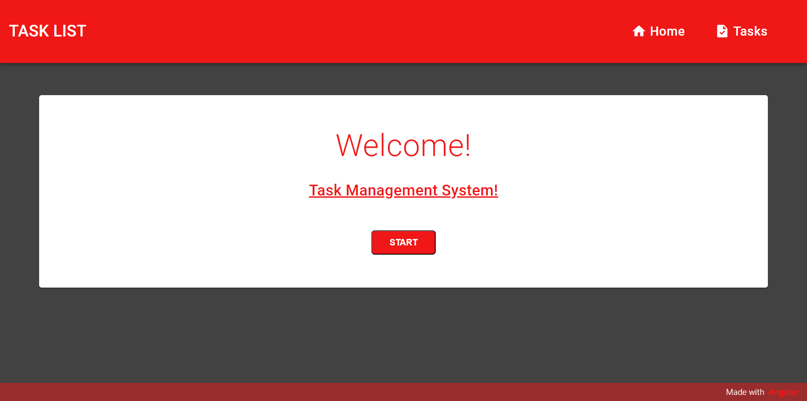
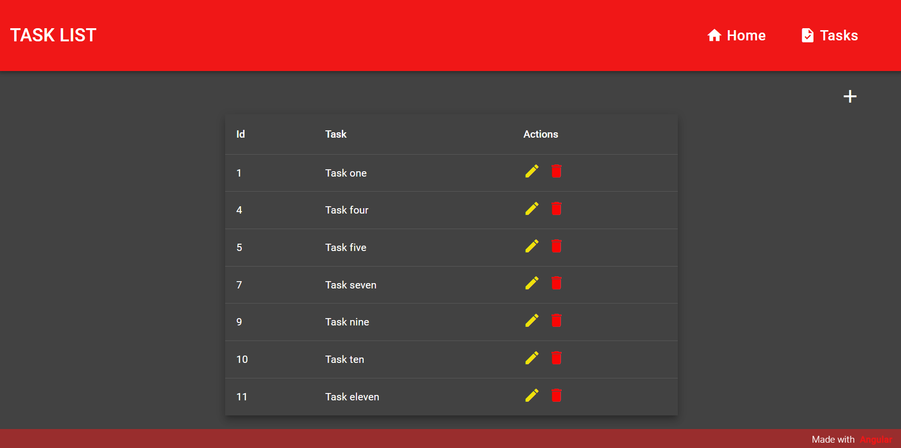
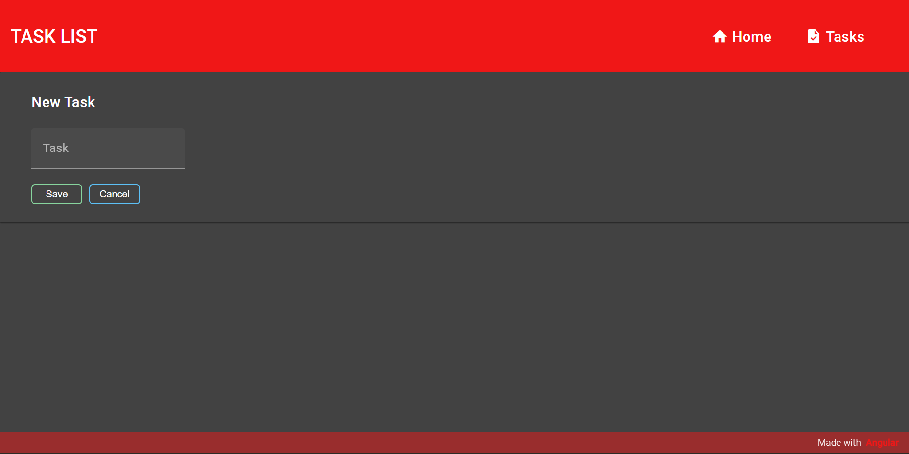
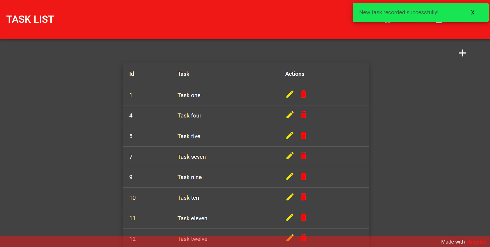
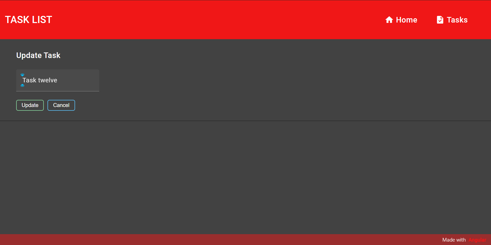
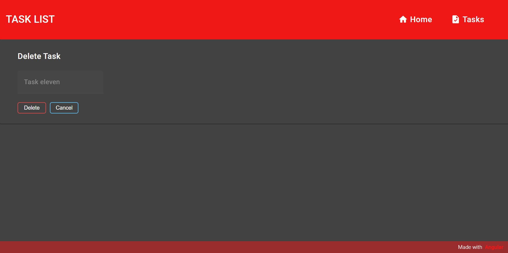
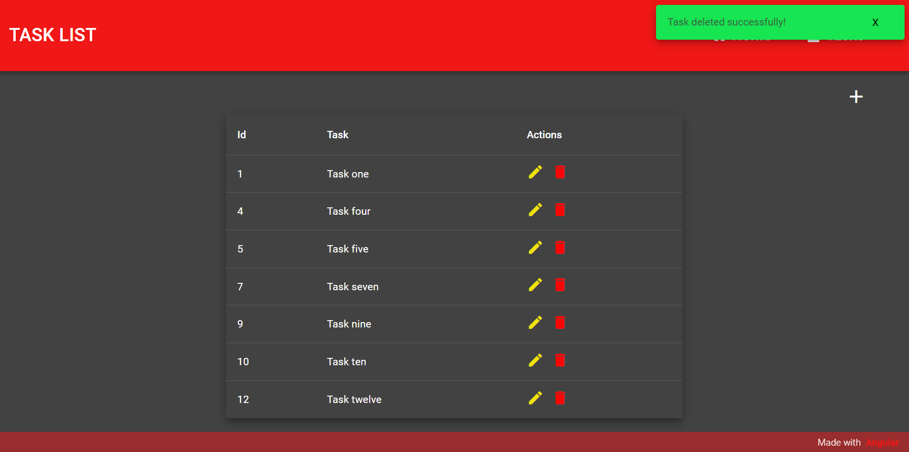

# PROJETO TASK LIST

Projeto pessoal de uma listagem de tarefas. O projeto se baseia em um CRUD (create, read, update e delete) simples, em que é possível adicionar uma nova tarefa, editar uma tarefa e excluir uma tarefa.

O projeto apresenta duas páginas principais, a página inicial "Home", de boas vindas, e a página da listagem das tarefas, "Task". A partir da página task é possível acessar as páginas de "create", "update" e "delete".

Ao realizar qualquer uma das operações de create, update e delete, uma barra de confirmação é exibida na parte superior direita da página.

Como banco de dados para inserção das tarefas, foi implementada uma api local utilizando json-server.

## Para rodar o programa

### No terminal digitar os comandos
> Para iniciar o backend: acessar a pasta backend e digitar o comando ``npm start``

> Para iniciar o projeto: acessar a pasta frontend e digitar o comando ``npm start``

## Tecnologias utilizada para criação do projeto

## Telas do projeto

Figura1: Página inicial Home

Figura2: Listagem de tarefas

Figura3: Página de adição de tarefa

Figura4: Confirmação de adição de nova tarefa

Figura5: Página de atualização de tarefa

Figura6: Página de deletar tarefa

Figura7: Confirmação de tarefa deletada.

>*Projeto desenvolvido em abril/2024*